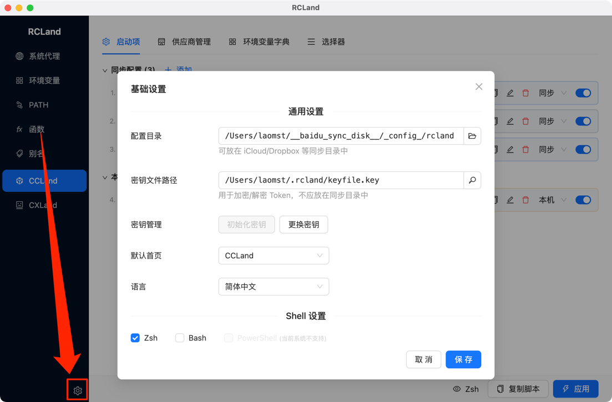
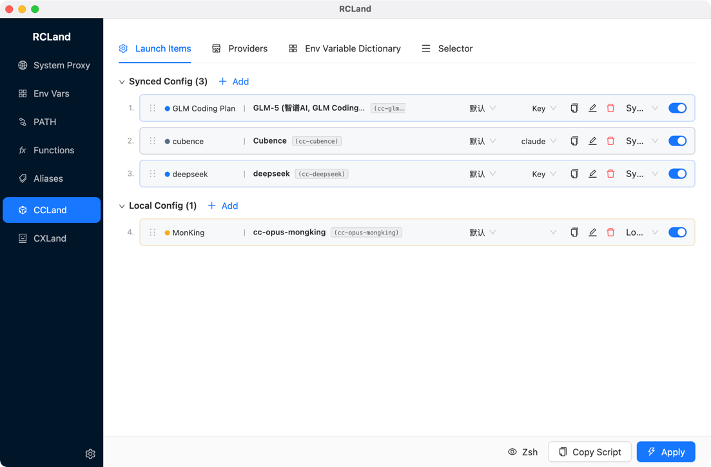
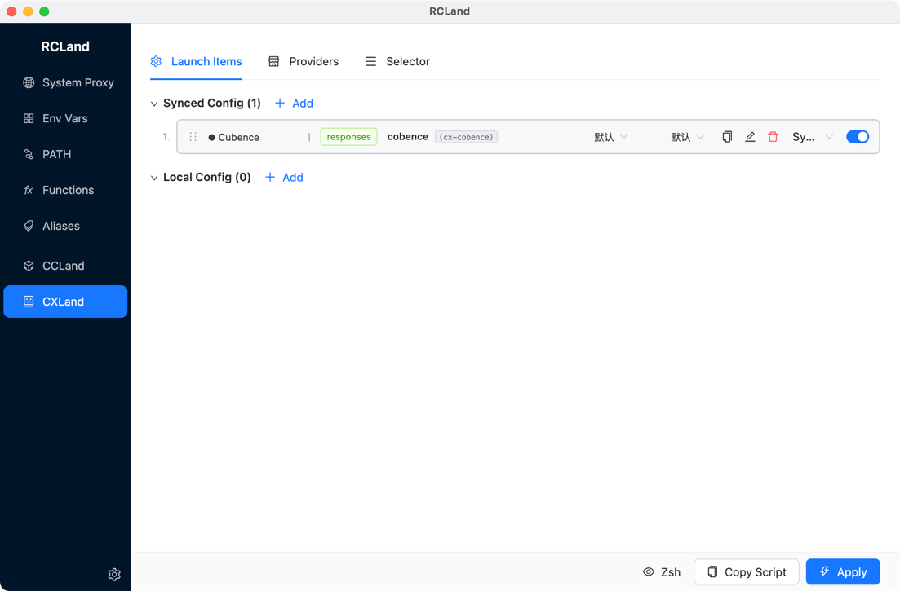

# RCLand

[中文文档](README.zh-CN.md)

A desktop application for managing [Claude Code](https://claude.ai/code) CLI and [Codex](https://github.com/openai/codex) CLI shell configurations. Manage multiple API providers, encrypted API keys, environment variables, PATH entries, shell functions, aliases, and system proxy — all from a single GUI with multi-shell support.

## Features

- **CC/CX Launch Items** — Create named launch items for Claude Code / Codex CLI with different API providers and models, each generating a dedicated shell function
- **Interactive Selector** — `cc` / `ccl` / `cx` / `cxl` shell functions that present an interactive terminal menu to pick from your launch items
- **Multi-Shell Support** — Zsh, Bash, and PowerShell with automatic OS detection
- **Variable References** — `{{VAR_NAME}}` syntax with topological sorting and circular reference detection
- **Encrypted Key Storage** — AES-256-GCM + PBKDF2, decrypted only at generation time
- **Environment Variables / PATH / Functions / Aliases** — Full CRUD with per-shell targeting, drag-to-reorder, local-only flag, live preview
- **System Proxy** — Read OS proxy settings, generate toggle functions (`proxy-on` / `proxy-off` / `proxy-status`)
- **Cloud Sync Friendly** — Local-only flag on any item; syncable JSON configs can be shared across machines

## Installation

<!-- TODO: Add download links when releases are published -->

| Platform | Format |
|----------|--------|
| macOS | `.zip` |
| Windows | `.exe` (NSIS installer) |
| Linux | `.AppImage` / `.deb` |

**Build from source:** Node.js 18+, npm 9+

```bash
git clone https://github.com/laomst/ccland.git
cd ccland && npm install && npm run dist
```

## Quick Start

<!-- 📸 Screenshot: settings modal -->


Open the app, click the **gear icon** to configure shells and encryption key, then set up providers and launch items.

## CC Launch

<!-- 📸 Screenshot: CC launch overview -->


CCLand manages Claude Code CLI configurations. Each launch item generates a shell function:

```bash
# Zsh / Bash — launch items are generated as shell functions
cc-sonnet() {
  ANTHROPIC_AUTH_TOKEN="sk-..."
  ANTHROPIC_BASE_URL="https://api.anthropic.com"
  ANTHROPIC_MODEL="claude-sonnet-4-20250514"
  claude "$@"
}

# PowerShell
function cc-sonnet {
  $env:ANTHROPIC_AUTH_TOKEN = "sk-..."
  $env:ANTHROPIC_BASE_URL = "https://api.anthropic.com"
  $env:ANTHROPIC_MODEL = "claude-sonnet-4-20250514"
  claude @args
}
```

**Usage:**

```bash
cc-sonnet                  # Launch Claude with Sonnet model
cc-sonnet --resume         # Resume last session
cc-opus                    # Launch with different model/provider
```

**Interactive Selector:**

```bash
cc                         # Show menu to pick from synced launch items
ccd                        # Same as: cc --dangerously-skip-permissions
ccl                        # Show menu for local-only launch items
ccld                       # Same as: ccl --dangerously-skip-permissions
```

**Four sub-tabs:**

- **Providers** — Define API services (name, endpoints, encrypted keys, default template, kanban URL)
- **Launch Items** — Combine provider + endpoint + key + env vars into a shell function. Supports **Passthrough mode** (runs `claude` directly without provider credentials)
- **Env Dictionary** — 13 built-in Claude Code env vars (`ANTHROPIC_MODEL`, `MAX_THINKING_TOKENS`, `CLAUDE_CODE_DISABLE_THINKING`, `API_TIMEOUT_MS`, `ANTHROPIC_BETAS`, etc.) with descriptions and `defaultInTemplate` toggle
- **Selector** — Configure `cc` / `ccl` interactive menu functions

## CX Launch

<!-- 📸 Screenshot: CX launch overview -->


Same workflow as CC Launch but for [Codex CLI](https://github.com/openai/codex). Config is passed via `-c key="value"` arguments:

```bash
# Zsh / Bash
cx-gpt4o() {
  codex -c "api_key=sk-..." -c "api_base=https://api.openai.com/v1" \
        -c "model=gpt-4o" "$@"
}

# PowerShell
function cx-gpt4o {
  codex -c "api_key=sk-..." -c "api_base=https://api.openai.com/v1" `
        -c "model=gpt-4o" @args
}
```

**Usage:**

```bash
cx-gpt4o                   # Launch Codex with GPT-4o
cx                         # Interactive selector
cxl                        # Interactive selector for local-only items
```

Supports two `wireApi` modes: `responses` (OpenAI official) / `chat` (third-party compatible).

## Shell Config Modules

**System Proxy** — Reads OS proxy settings (macOS `scutil`, Windows Registry, Linux `gsettings`). Generates `proxy-on` / `proxy-off` / `proxy-status` shell functions with customizable names.

**Environment Variables** — Per-shell targeting, enable/disable, optional encryption, `{{VAR}}` references, drag-to-reorder, synced/local grouping.

**PATH Management** — Two sub-tabs: PATH entries (directories with descriptions and priority ordering) and Path Variables (reusable variables like `JAVA_HOME` that resolve at generation time).

**Shell Functions** — Per-shell body variants, automatic name extraction, category grouping. Built-in read-only functions: `pathls`, `check-env-exists`, `prompt-select`, `set_main_task_name`.

**Shell Aliases** — Simple `alias name='command'` with per-shell targeting and descriptions.

**Presets** — Built-in packs: common aliases, Git shortcuts, SDK paths. Import via the Import button.

## How It Works

RCLand generates shell scripts to `~/.rcland/` and injects a `source` line into your shell profile:

```bash
# >>> RCLand >>>
source ~/.rcland/zshrc
# <<< RCLand <<<
```

Use the bottom action bar to preview the generated script before applying.

## Encryption

AES-256-GCM with PBKDF2 (SHA-256, 100k iterations). Encrypted values stored as `enc:v1:{base64}`. Supports temporary key mode and full re-encryption on key change.

## Data Storage

| File | Content | Syncable |
|------|---------|----------|
| `rcland.config.claudecode.json` | CC providers, launch items, selector | Yes |
| `rcland.config.codex.json` | CX providers, launch items, selector | Yes |
| `rcland.config.shell.json` | Variables, PATH, functions, aliases | Yes |
| `rcland.claude-env-dict.json` | Env dictionary (user items + overrides) | Yes |
| `local/` | Local-only data | No |
| `backups/` | Auto backups (10/shell) | No |
| `~/.rcland/` | Generated shell scripts | No |

## Development

```bash
npm run dev       # Electron + Vite HMR
npm run build     # TypeScript + bundle
npm run dist      # Platform installer
npm test          # 94 tests (esbuild + node --test)
```

| Layer | Technology |
|-------|-----------|
| Desktop | Electron 35 |
| UI | React 19 + Ant Design 5 |
| State | Zustand 5 |
| Build | electron-vite 3 |

## License

<!-- TODO: Add license information -->
