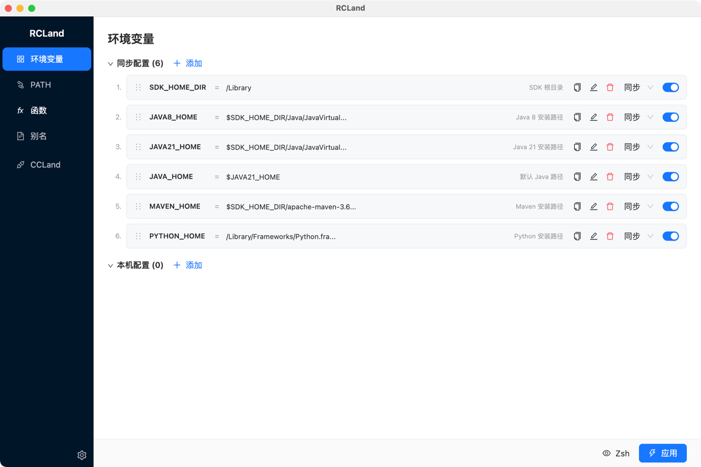

# CCland

[中文文档](README.zh-CN.md)

A desktop application for managing [Claude Code](https://claude.ai/code) CLI shell configurations. Manage multiple API providers, encrypted API keys, environment variables, PATH entries, shell functions, aliases — all from a single GUI, with multi-shell support.

<!-- Screenshot placeholder: main interface overview -->
<!--  -->

## Features

- **Multi-Shell Support** — Zsh, Bash, and PowerShell with automatic OS detection
- **CC Launch Configs** — Create named launch configurations for different API providers and models, each generating a dedicated shell function (e.g., `cc-glm`, `cc-sonnet`)
- **Interactive Selector** — Optional `cc` / `ccl` shell functions that present a menu to pick from all your launch configs
- **Encrypted Key Storage** — API keys encrypted with AES-256-GCM; decrypted only at config generation time
- **Environment Variables** — Manage shell environment variables with per-shell support
- **PATH Management** — Add, reorder, and toggle PATH entries with descriptions
- **Shell Functions** — Define multi-shell functions with per-shell body variants; includes built-in utilities (`pathls`, `check-env-exists`, `prompt-select`)
- **Shell Aliases** — Quick command aliases with per-shell support
- **Drag & Drop Reordering** — All items support drag-to-reorder
- **Local-Only Mode** — Mark any provider, config, variable, or alias as local-only to exclude from cloud sync
- **Live Preview** — Preview generated shell scripts before applying
- **Conflict Detection** — Warnings for duplicate variables, alias-function conflicts, and shadowed commands

## Installation

### Pre-built Binaries

Download the latest release for your platform:

| Platform | Format |
|----------|--------|
| macOS | `.zip` |
| Windows | `.exe` (NSIS installer) |
| Linux | `.AppImage` / `.deb` |

<!-- TODO: Add download links when releases are published -->

### Build from Source

```bash
git clone https://github.com/laomst/ccland.git
cd ccland
npm install
npm run dist    # Build platform installer
```

## Quick Start

### 1. Launch CCland

Open the application. You'll see the sidebar with five modules:

- **Env** — Environment Variables
- **PATH** — PATH Management
- **Functions** — Shell Functions
- **Aliases** — Shell Aliases
- **CCLaunch** — Claude Code Launch Configurations

<!-- Screenshot placeholder: sidebar navigation -->
<!--  -->

### 2. Configure Shell Profiles

Click the **gear icon** (top-right) to open Settings:

- Enable the shells you use (Zsh/Bash on macOS/Linux, PowerShell on Windows)
- Set your encryption key file path (for API key encryption)
- Choose your default landing page

<!-- Screenshot placeholder: settings modal -->
<!--  -->

### 3. Set Up a Provider (CC Launch)

Navigate to the **CCLaunch** tab → **Providers** sub-tab:

1. Click **Add Provider**
2. Enter a name (e.g., "Anthropic", "OpenRouter", "GLM")
3. Add one or more **Endpoints** (API base URLs)
4. Add one or more **API Keys** (encrypted automatically)
5. Optionally configure a **Template** with default environment variables

<!-- Screenshot placeholder: provider form -->
<!--  -->

### 4. Create a Launch Config

Switch to the **Configs** sub-tab:

1. Click **Add Config**
2. Select a provider, endpoint, and API key
3. Set a **function name** (this becomes a shell function, e.g., `cc-sonnet`)
4. Configure Claude-specific env vars:
   - `ANTHROPIC_MODEL` — main model name
   - `ANTHROPIC_DEFAULT_OPUS_MODEL` / `SONNET` / `HAIKU` — model overrides
   - `API_TIMEOUT_MS` — request timeout
5. Save

<!-- Screenshot placeholder: config form -->
<!--  -->

### 5. Enable the Selector (Optional)

At the top of the CCLaunch page, toggle the **Selector** switch:

- Set a **function name** (default: `cc`) — this creates an interactive menu function
- Set a **prompt title** (e.g., "Select launcher")

This generates:

| Function | Description |
|----------|-------------|
| `cc` | Interactive selector for synced configs |
| `ccd` | Shorthand for `cc --dangerously-skip-permissions` |
| `ccl` | Interactive selector for local-only configs |
| `ccld` | Shorthand for `ccl --dangerously-skip-permissions` |

<!-- Screenshot placeholder: selector demo -->
<!--  -->

### 6. Preview & Apply

Use the bottom action bar:

1. Click a shell name button (e.g., **Zsh**) to preview the generated script
2. Click **Apply** to write configs to your shell profiles

CCland writes to `~/.rcland/{shell}rc` and injects a `source` line into your shell profile (e.g., `~/.zshrc`):

```bash
# >>> RCLand >>>
source ~/.rcland/zshrc
# <<< RCLand <<<
```

Restart your terminal or run `source ~/.zshrc` to activate.

<!-- Screenshot placeholder: preview modal -->
<!--  -->

## Module Guide

### Environment Variables

Manage shell environment variables. Each variable supports:
- Per-shell targeting (Zsh, Bash, PowerShell)
- Enable/disable toggle
- Optional encryption for sensitive values
- Local-only flag
- Drag-to-reorder

<!-- Screenshot placeholder: env var page -->
<!--  -->

### PATH Management

Add directories to your shell PATH:
- Description field for documentation
- Per-shell targeting
- Enable/disable toggle
- Drag-to-reorder (order determines PATH priority)

### Shell Functions

Define custom shell functions:
- Multi-shell support with per-shell body variants
- Automatic function name extraction from body
- Category grouping
- Built-in read-only functions included automatically:
  - `pathls` — Display PATH entries with `-i` flag for detailed info
  - `check-env-exists` — Verify required env vars are set
  - `prompt-select` — Interactive menu selector (used internally by CC Launch)

### Shell Aliases

Create command aliases:
- Simple `alias name='command'` definitions
- Per-shell targeting
- Descriptions

### CC Launch

The core feature — manage multiple Claude Code CLI configurations:

**Providers** define API services:
- Name and color tag
- Multiple endpoints (API base URLs)
- Multiple API keys (encrypted)
- Template with default env vars

**Configs** combine provider + endpoint + key + env vars into a launch function:

```bash
# Example generated function (Zsh/Bash)
cc-sonnet() {
  ANTHROPIC_AUTH_TOKEN="sk-..." \
  ANTHROPIC_BASE_URL="https://api.anthropic.com" \
  ANTHROPIC_MODEL="claude-sonnet-4-20250514" \
  claude "$@"
}
```

```powershell
# Example generated function (PowerShell)
function cc-sonnet {
  $env:ANTHROPIC_AUTH_TOKEN = "sk-..."
  $env:ANTHROPIC_BASE_URL = "https://api.anthropic.com"
  $env:ANTHROPIC_MODEL = "claude-sonnet-4-20250514"
  claude @args
}
```

## Encryption

CCland uses **AES-256-GCM** encryption for sensitive data (API keys/tokens):

- Encrypted values stored as `enc:v1:{hex}` format
- Key derived from passphrase or stored in a key file
- Decryption happens on-demand during config generation
- Temporary key mode available for one-off apply operations

**First-time setup:** When you click Apply for the first time, CCland will prompt you to initialize an encryption key.

## Data Storage

| File | Content | Syncable |
|------|---------|----------|
| `rcland.config.claudecode.json` | Providers, Configs, Selector | Yes |
| `rcland.config.shell.json` | Variables, PATH, Functions, Aliases | Yes |
| Electron userData | App settings (profiles, key path) | No |
| `~/.rcland/` | Generated shell scripts | No |

## Development

### Prerequisites

- Node.js 18+
- npm 9+

### Commands

```bash
npm install       # Install dependencies
npm run dev       # Start dev server (Electron + Vite HMR)
npm run build     # Compile TypeScript and bundle
npm run preview   # Preview built app
npm run pack      # Package as directory (unsigned)
npm run dist      # Build platform installer
```

### Tech Stack

- **Electron 35** — Desktop framework
- **React 19** — UI library
- **TypeScript 5.8** — Type safety
- **Ant Design 5** — UI components
- **Zustand 5** — State management
- **@dnd-kit** — Drag and drop
- **electron-vite** — Build tooling

### Architecture

```
┌─────────────────────────────────────────────┐
│                  Renderer                    │
│   React 19 + Ant Design + Zustand Stores    │
│   (src/renderer/src/)                        │
├─────────────────────────────────────────────┤
│              Preload (Context Bridge)        │
│   Type-safe IPC bridge → window.electronAPI  │
│   (src/preload/)                             │
├─────────────────────────────────────────────┤
│                    Main                      │
│   App lifecycle, File I/O, Crypto, Shell     │
│   generators (Zsh/Bash/PowerShell)           │
│   (src/main/)                                │
└─────────────────────────────────────────────┘
```

## License

<!-- TODO: Add license information -->
