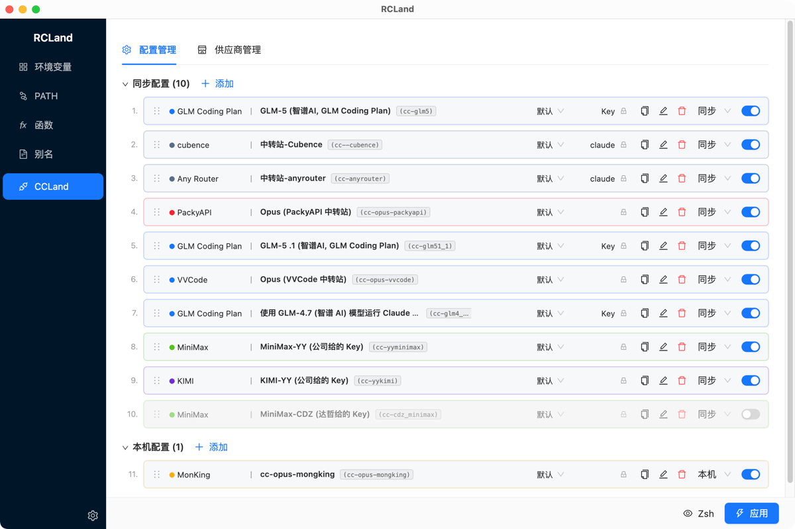
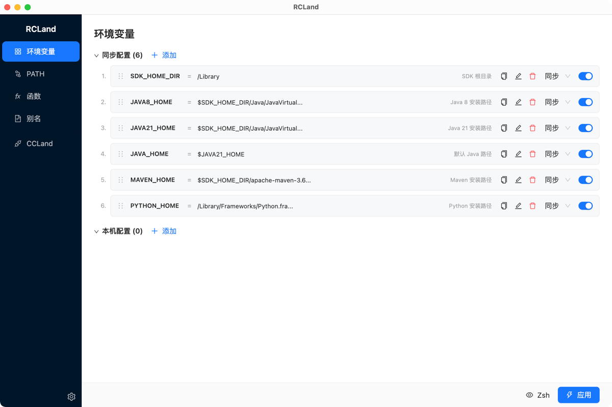
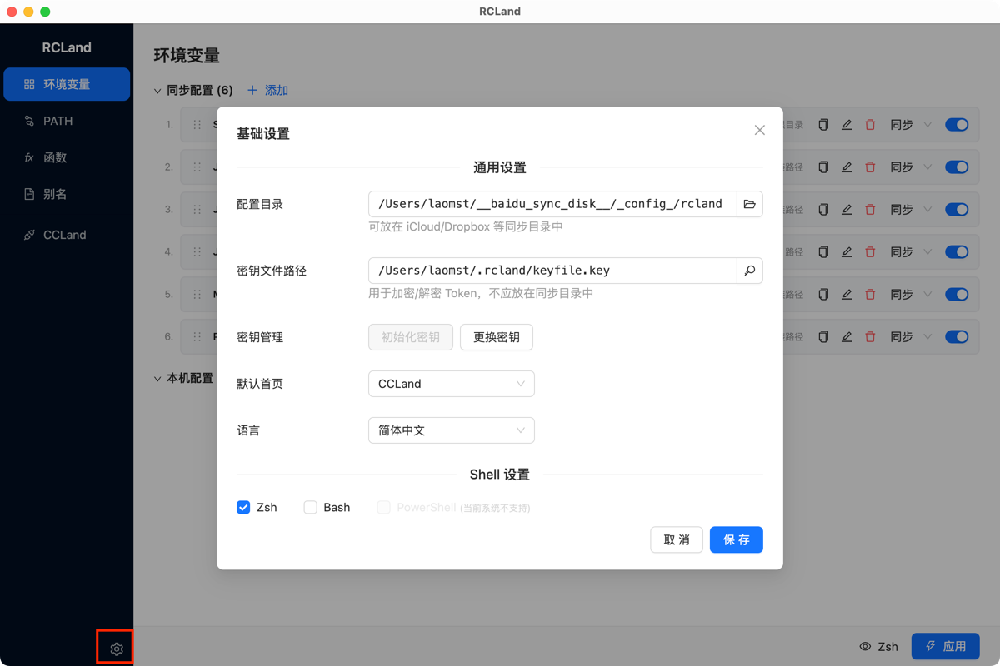
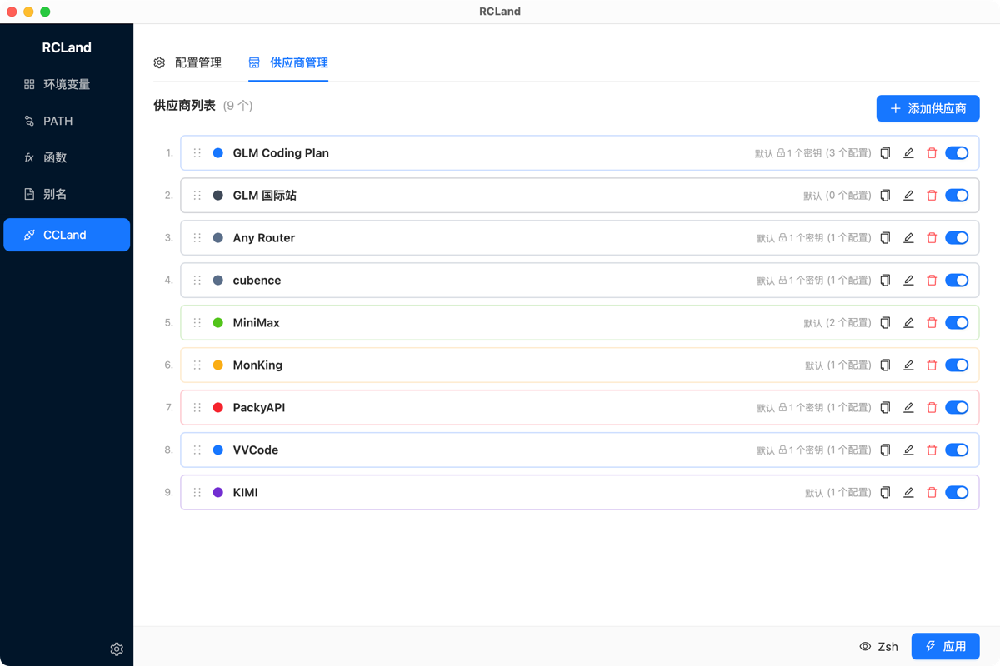

# CCland

[English](README.md)

一款桌面应用，用于管理 [Claude Code](https://claude.ai/code) CLI 的 Shell 配置。通过可视化界面管理多个 API Provider、加密密钥、环境变量、PATH、Shell 函数和别名，支持多 Shell。

<!-- 截图占位：主界面总览 -->

## 功能特性

- **多 Shell 支持** — Zsh、Bash、PowerShell，自动检测操作系统
- **CC Launch 配置** — 为不同 API Provider 和模型创建命名启动配置，每个配置生成独立的 Shell 函数（如 `cc-glm`、`cc-sonnet`）
- **交互式选择器** — 可选的 `cc` / `ccl` Shell 函数，弹出菜单选择启动配置
- **加密密钥存储** — API 密钥使用 AES-256-GCM 加密，仅在生成配置时解密
- **环境变量管理** — 按 Shell 类型管理环境变量
- **PATH 管理** — 添加、排序、切换 PATH 条目
- **Shell 函数** — 支持多 Shell 函数体变体，含内置工具函数（`pathls`、`check-env-exists`、`prompt-select`）
- **Shell 别名** — 快捷命令别名
- **拖拽排序** — 所有项目支持拖拽重排
- **本地专属模式** — 标记为 local-only 的项目不参与云同步
- **实时预览** — 应用前预览生成的 Shell 脚本
- **冲突检测** — 检测重复变量、别名-函数冲突、命令覆盖

## 安装

### 从源码构建

```bash
git clone https://github.com/laomst/ccland.git
cd ccland
npm install
npm run dist    # 构建平台安装包
```

## 快速上手

### 1. 启动应用

打开 CCland，左侧导航栏包含五个模块：

- **Env** — 环境变量
- **PATH** — PATH 管理
- **Functions** — Shell 函数
- **Aliases** — Shell 别名
- **CCLand** — Claude Code 启动配置



### 2. 配置 Shell Profile

点击左下角 **齿轮图标** 打开设置：

- 启用你使用的 Shell（macOS/Linux 上的 Zsh/Bash，Windows 上的 PowerShell）
- 设置加密密钥文件路径
- 选择默认页面



### 3. 添加 Provider

进入 **CCLand** → **Providers** 子标签：

1. 点击 **添加 Provider**
2. 输入名称（如 "Anthropic"、"OpenRouter"、"GLM"）
3. 添加 **Endpoint**（API 地址）
4. 添加 **API Key**（自动加密）
5. 可选：配置 **Template** 设置默认环境变量



### 4. 创建启动配置

切换到 **Configs** 子标签：

1. 点击 **添加 Config**
2. 选择 Provider、Endpoint、API Key
3. 设置 **函数名**（将生成 Shell 函数，如 `cc-sonnet`）
4. 配置 Claude 环境变量：
   - `ANTHROPIC_MODEL` — 主模型名称
   - `ANTHROPIC_DEFAULT_OPUS_MODEL` / `SONNET` / `HAIKU` — 模型覆盖
   - `API_TIMEOUT_MS` — 请求超时
5. 保存


生成的函数：

| 函数 | 说明 |
|------|------|
| `cc` | 交互式选择已同步的配置 |
| `ccd` | `cc --dangerously-skip-permissions` 的快捷方式 |
| `ccl` | 交互式选择本地专属配置 |
| `ccld` | `ccl --dangerously-skip-permissions` 的快捷方式 |

<!-- 截图占位：选择器演示 -->
<!--  -->

### 6. 预览与应用

使用底部操作栏：

1. 点击 Shell 名称按钮（如 **Zsh**）预览生成的脚本
2. 点击 **应用** 写入 Shell 配置文件

CCland 将配置写入 `~/.rcland/{shell}rc`，并在 Shell profile（如 `~/.zshrc`）中注入 source 行：

```bash
# >>> RCLand >>>
source ~/.rcland/zshrc
# <<< RCLand <<<
```

重启终端或执行 `source ~/.zshrc` 即可生效。

<!-- 截图占位：预览弹窗 -->
<!--  -->

## 模块说明

### 环境变量

管理 Shell 环境变量，支持：
- 按 Shell 类型筛选
- 启用/禁用开关
- 敏感值加密
- 本地专属标记
- 拖拽排序

<!-- 截图占位：环境变量页面 -->
<!--  -->

### PATH 管理

管理 Shell PATH 条目：
- 描述字段用于备注
- 按 Shell 类型筛选
- 启用/禁用开关
- 拖拽排序（顺序决定 PATH 优先级）

### Shell 函数

定义自定义 Shell 函数：
- 多 Shell 支持，可为不同 Shell 编写不同函数体
- 自动从函数体提取函数名
- 分类分组
- 自动包含内置只读函数：
  - `pathls` — 显示 PATH 条目，`-i` 参数查看详情
  - `check-env-exists` — 检查必需环境变量是否已设置
  - `prompt-select` — 交互式菜单选择器（CC Launch 内部使用）

### Shell 别名

创建命令别名：
- 简单的 `alias name='command'` 定义
- 按 Shell 类型筛选
- 描述字段

### CC Launch

核心功能 — 管理多个 Claude Code CLI 配置：

**Provider** 定义 API 服务：
- 名称和颜色标签
- 多个 Endpoint（API 地址）
- 多个 API Key（加密存储）
- Template 模板（默认环境变量）

**Config** 组合 Provider + Endpoint + Key + 环境变量，生成启动函数：

```bash
# 生成的函数示例（Zsh/Bash）
cc-sonnet() {
  ANTHROPIC_AUTH_TOKEN="sk-..." \
  ANTHROPIC_BASE_URL="https://api.anthropic.com" \
  ANTHROPIC_MODEL="claude-sonnet-4-20250514" \
  claude "$@"
}
```

```powershell
# 生成的函数示例（PowerShell）
function cc-sonnet {
  $env:ANTHROPIC_AUTH_TOKEN = "sk-..."
  $env:ANTHROPIC_BASE_URL = "https://api.anthropic.com"
  $env:ANTHROPIC_MODEL = "claude-sonnet-4-20250514"
  claude @args
}
```

## 加密机制

CCland 使用 **AES-256-GCM** 加密敏感数据（API 密钥/Token）：

- 加密值以 `enc:v1:{hex}` 格式存储
- 密钥从口令派生或从密钥文件读取
- 仅在生成配置时按需解密
- 支持临时密钥模式，用于一次性应用

**首次使用：** 首次点击"应用"时，CCland 会提示初始化加密密钥。

## 数据存储

| 文件 | 内容 | 可同步 |
|------|------|--------|
| `rcland.config.claudecode.json` | Provider、Config、Selector | 是 |
| `rcland.config.shell.json` | 变量、PATH、函数、别名 | 是 |
| Electron userData | 应用设置（Shell profile、密钥路径） | 否 |
| `~/.rcland/` | 生成的 Shell 脚本 | 否 |

## 开发

### 前置要求

- Node.js 18+
- npm 9+

### 命令

```bash
npm install       # 安装依赖
npm run dev       # 启动开发服务器（Electron + Vite HMR）
npm run build     # 编译 TypeScript 并打包
npm run preview   # 预览构建产物
npm run pack      # 打包为目录（不签名）
npm run dist      # 构建平台安装包
```

### 技术栈

- **Electron 35** — 桌面框架
- **React 19** — UI 库
- **TypeScript 5.8** — 类型安全
- **Ant Design 5** — UI 组件库
- **Zustand 5** — 状态管理
- **@dnd-kit** — 拖拽排序
- **electron-vite** — 构建工具

### 架构

```
┌─────────────────────────────────────────────┐
│                  Renderer                    │
│   React 19 + Ant Design + Zustand Stores    │
│   (src/renderer/src/)                        │
├─────────────────────────────────────────────┤
│            Preload（Context Bridge）          │
│   类型安全 IPC 桥接 → window.electronAPI      │
│   (src/preload/)                             │
├─────────────────────────────────────────────┤
│                    Main                      │
│   应用生命周期、文件 I/O、加密、Shell 生成器    │
│   （Zsh/Bash/PowerShell）                     │
│   (src/main/)                                │
└─────────────────────────────────────────────┘
```

## 许可证

<!-- TODO: 添加许可证信息 -->
