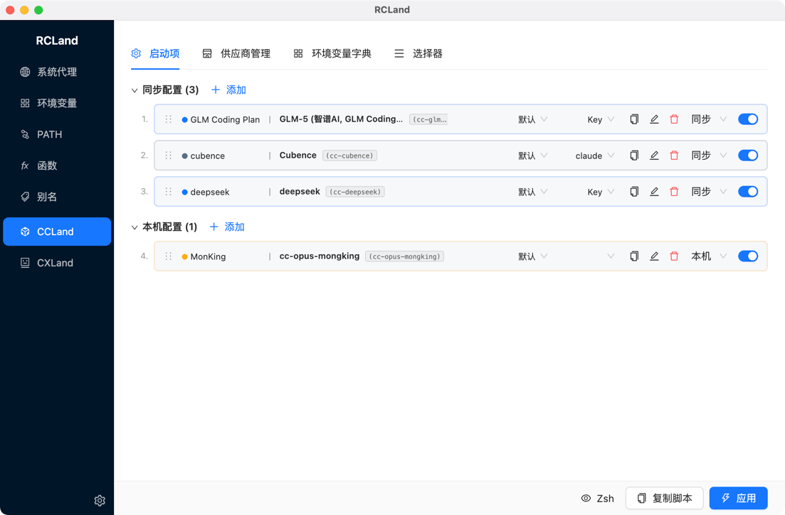
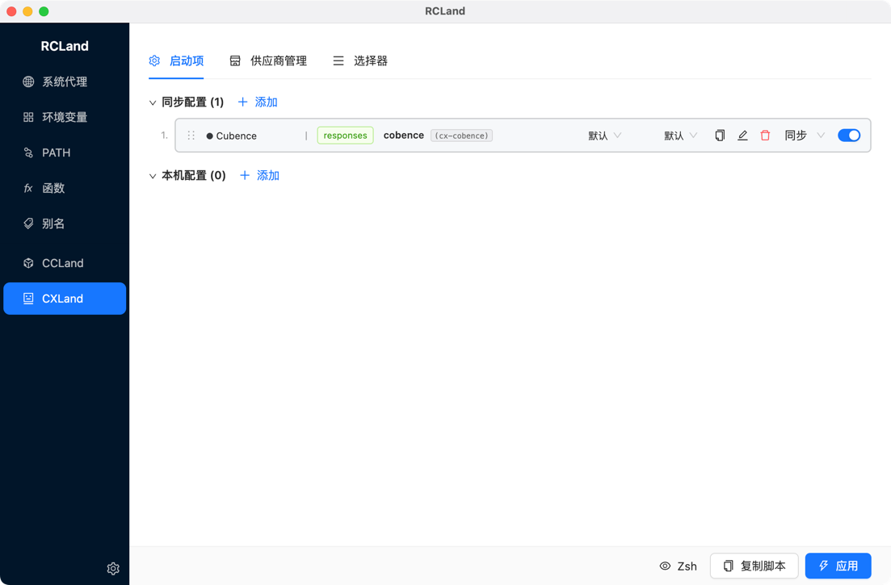

# RCLand

[English](README.md)

一款桌面应用，用于管理 [Claude Code](https://claude.ai/code) CLI 和 [Codex](https://github.com/openai/codex) CLI 的 Shell 配置。通过可视化界面管理多个 API Provider、加密密钥、环境变量、PATH、Shell 函数、别名和系统代理，支持多 Shell。

## 功能特性

- **CC/CX 启动项** — 为 Claude Code / Codex CLI 创建命名启动项，每个生成独立的 Shell 函数
- **交互式选择器** — `cc` / `ccl` / `cx` / `cxl` Shell 函数，弹出交互式终端菜单选择启动项
- **多 Shell 支持** — Zsh、Bash、PowerShell，自动检测操作系统
- **变量引用** — `{{VAR_NAME}}` 语法，支持拓扑排序和循环引用检测
- **加密密钥存储** — AES-256-GCM + PBKDF2，仅在生成配置时解密
- **环境变量 / PATH / 函数 / 别名** — 完整 CRUD，按 Shell 筛选，拖拽排序，本地专属标记，实时预览
- **系统代理** — 读取 OS 代理设置，生成切换函数（`proxy-on` / `proxy-off` / `proxy-status`）
- **云同步友好** — 任何项目可标记 local-only；可同步的 JSON 配置可跨机器共享

## 工作原理

RCLand 支持 Zsh、Bash、PowerShell 三种 Shell，自动检测操作系统。每种 Shell 生成独立的脚本文件：

| Shell | 输出文件 | Profile 注入 |
|-------|----------|-------------|
| Zsh | `~/.rcland/zshrc` | `source` 写入 `~/.zshrc` |
| Bash | `~/.rcland/bashrc` | `source` 写入 `~/.bashrc` |
| PowerShell | `~/.rcland/profile.ps1` | `. ` 写入 `$PROFILE` |

```bash
# >>> RCLand >>>                 # Zsh / Bash
source ~/.rcland/zshrc
# <<< RCLand <<<

# >>> RCLand >>>                 # PowerShell
. "$HOME/.rcland/profile.ps1"
# <<< RCLand <<<
```

使用底部操作栏可以在应用前预览生成的脚本。

## 安装

<!-- TODO: 发布后添加下载链接 -->

| 平台 | 格式 |
|------|------|
| macOS | `.zip` |
| Windows | `.exe`（NSIS 安装包） |
| Linux | `.AppImage` / `.deb` |

**从源码构建：** Node.js 18+、npm 9+

```bash
git clone https://github.com/laomst/ccland.git
cd ccland && npm install && npm run dist
```

## 快速上手

<!-- 📸 截图：设置弹窗 -->


打开应用，点击 **齿轮图标** 配置 Shell 和加密密钥，然后设置 Provider 和启动项即可。

## CC Launch

<!-- 📸 截图：CC Launch 总览 -->


CCLand 管理 Claude Code CLI 配置。每个启动项生成一个 Shell 函数：

```bash
# Zsh / Bash — 启动项生成为 Shell 函数
cc-sonnet() {
  ANTHROPIC_AUTH_TOKEN="sk-..."
  ANTHROPIC_BASE_URL="https://api.anthropic.com"
  ANTHROPIC_MODEL="claude-sonnet-4-20250514"
  claude "$@"
}

# PowerShell
function cc-sonnet {
  $env:ANTHROPIC_AUTH_TOKEN = "sk-..."
  $env:ANTHROPIC_BASE_URL = "https://api.anthropic.com"
  $env:ANTHROPIC_MODEL = "claude-sonnet-4-20250514"
  claude @args
}
```

**使用：**

```bash
cc-sonnet                  # 使用 Sonnet 模型启动 Claude
cc-sonnet --resume         # 恢复上次会话
cc-opus                    # 使用其他模型/Provider 启动
```

**交互式选择器：**

所有选择器函数名均可在选择器标签页自定义。默认值：

```bash
cc                         # 弹出菜单选择已同步的启动项
ccd                        # 等同于: cc --dangerously-skip-permissions
ccl                        # 弹出菜单选择本地专属启动项
ccld                       # 等同于: ccl --dangerously-skip-permissions
```

**四个子标签：**

- **Provider** — 定义 API 服务（名称、Endpoint、加密密钥、默认模板、Kanban URL）
- **启动项** — 组合 Provider + Endpoint + Key + 环境变量生成 Shell 函数。支持 **Passthrough 模式**（直接运行 `claude`，不注入 Provider 凭据）
- **环境变量字典** — 13 个内置 Claude Code 环境变量（`ANTHROPIC_MODEL`、`MAX_THINKING_TOKENS`、`CLAUDE_CODE_DISABLE_THINKING`、`API_TIMEOUT_MS`、`ANTHROPIC_BETAS` 等），含描述和 `defaultInTemplate` 开关
- **选择器** — 配置交互式菜单的函数名和提示标题

## CX Launch

<!-- 📸 截图：CX Launch 总览 -->


与 CC Launch 相同的工作流，但用于 [Codex CLI](https://github.com/openai/codex)。通过 `-c key="value"` 参数传递配置：

```bash
# Zsh / Bash
cx-gpt4o() {
  codex -c "api_key=sk-..." -c "api_base=https://api.openai.com/v1" \
        -c "model=gpt-4o" "$@"
}

# PowerShell
function cx-gpt4o {
  codex -c "api_key=sk-..." -c "api_base=https://api.openai.com/v1" `
        -c "model=gpt-4o" @args
}
```

**使用：**

```bash
cx-gpt4o                   # 使用 GPT-4o 启动 Codex
cx                         # 交互式选择器
cxl                        # 本地专属启动项选择器
```

支持两种 `wireApi` 模式：`responses`（OpenAI 官方）/ `chat`（第三方兼容）。

## Shell 配置模块

**系统代理** — 读取操作系统代理设置（macOS `scutil`、Windows 注册表、Linux `gsettings`），生成 `proxy-on` / `proxy-off` / `proxy-status` Shell 函数，函数名可自定义。

**环境变量** — 按 Shell 筛选，启用/禁用，可选加密，`{{VAR}}` 引用，拖拽排序，按已同步/本机分组。

**PATH 管理** — 两个子标签：PATH 条目（目录 + 描述 + 优先级排序）和路径变量（可复用变量如 `JAVA_HOME`，在生成时解析）。

**Shell 函数** — 多 Shell 函数体变体，自动提取函数名，分类分组。内置只读函数：`pathls`、`check-env-exists`、`prompt-select`、`set_main_task_name`。

**Shell 别名** — `alias name='command'`，按 Shell 筛选，描述字段。

**预设** — 内置包：常用别名、Git 快捷方式、SDK 路径。通过导入按钮一键导入。

## 加密

AES-256-GCM + PBKDF2（SHA-256，100k 迭代）。加密值以 `enc:v1:{base64}` 格式存储。支持临时密钥模式和更换密钥时全量重新加密。

## 数据存储

| 文件 | 内容 | 可同步 |
|------|------|--------|
| `rcland.config.claudecode.json` | CC Provider、启动项、选择器 | 是 |
| `rcland.config.codex.json` | CX Provider、启动项、选择器 | 是 |
| `rcland.config.shell.json` | 变量、PATH、函数、别名 | 是 |
| `rcland.claude-env-dict.json` | 环境变量字典（用户条目 + 覆盖） | 是 |
| `local/` | 本地专属数据 | 否 |
| `backups/` | 自动备份（每个 Shell 最多 10 份） | 否 |
| `~/.rcland/` | 生成的 Shell 脚本 | 否 |

## 开发

```bash
npm run dev       # Electron + Vite HMR
npm run build     # TypeScript + 打包
npm run dist      # 构建安装包
npm test          # 94 个测试（esbuild + node --test）
```

| 层级 | 技术 |
|------|------|
| 桌面 | Electron 35 |
| UI | React 19 + Ant Design 5 |
| 状态 | Zustand 5 |
| 构建 | electron-vite 3 |

## 许可证

<!-- TODO: 添加许可证信息 -->
